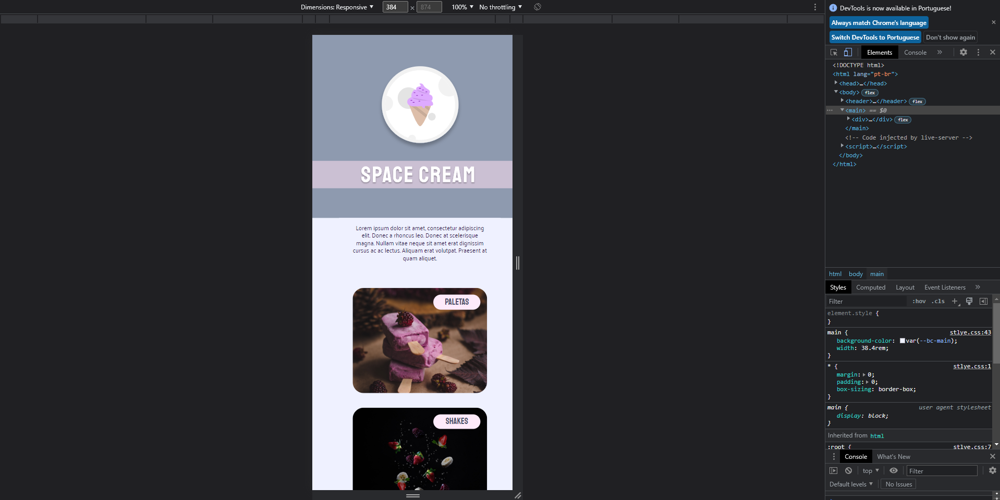

<h1 align="center"> Mobile first 📱 </h1>

 

  

## 🖥️ Tecnologias

Esse projeto foi desenvolvido com as seguintes tecnologias:

- HTML 
- CSS
- Git e Github

## 📂 Projeto

  Projeto foi recriado uma aplicação a partir de um layout pronto no figma, para fortalecer alguns conceitos aprendidos entre eles:

      <li>Projeto em HTML e CSS.</li>
      <li>Posicionamentos e alinhamentos de elementos. </li>
      <li>Fontes customizadas.</li>
      <li>Espaçamentos.</li>
      <li>Mobile First.
      <li>Unidade de medida flexível.</li>
      <li>Variáveis.</li>
      <li>Animações simples.</li>
  </ul>

 

## 🔖 Layout

Você pode visualizar o layout do projeto através [DESSE LINK](https://www.figma.com/file/8Z2TGPPS6urCnelSXVuH0K/Stage-03---Mobile-First-(Copy)?node-id=12%3A137&t=0v7MvvznUe33ZwPF-0). É necessário ter conta no [Figma](https://figma.com) para acessá-lo. 

  

## 📧 Contato

E-mail: victorvbprogramador@gmail.com

Linkedin: https://www.linkedin.com/in/victor-vinicius-9b0765263/

